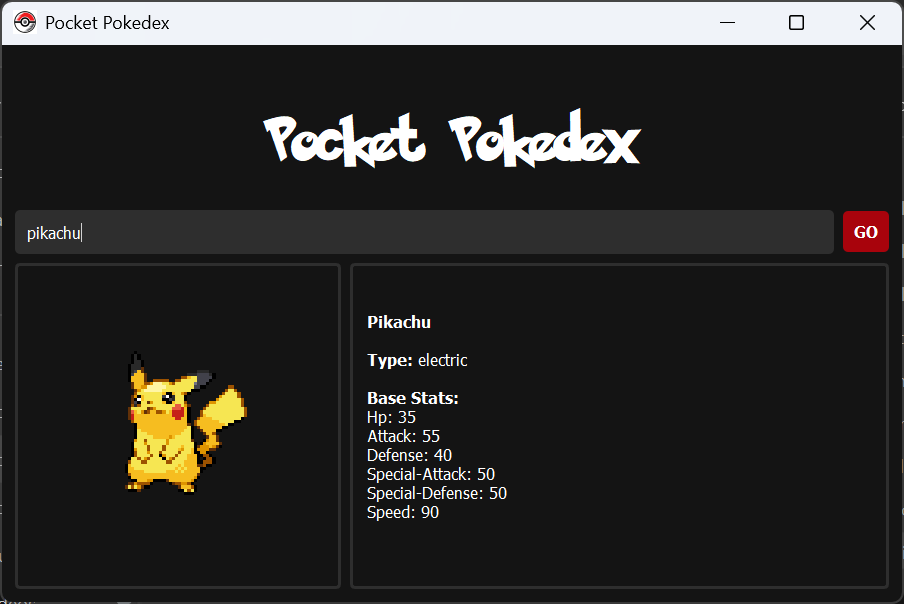
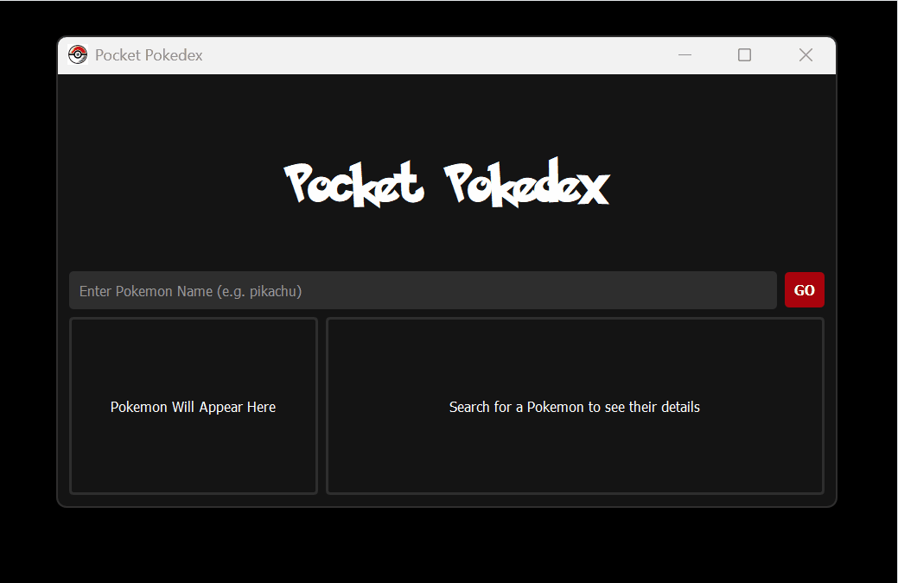

# 🎒 Pocket Pokedex

A lightweight and stylish desktop app built with **Python** and **PyQt5** that lets you search for any Pokémon using the [PokeAPI](https://pokeapi.co/). Displays Pokémon stats, types, and official sprite images in a neat, responsive interface.

<br>



<br>



---

## 🧰 Features

- 🔍 **Search Pokémon by name** (e.g., `pikachu`, `charizard`)
- 🧬 **Displays base stats** and type(s)
- 🎨 **Custom fonts, dark theme & hover effects**
- 🖼️ **Auto-fetches official Pokémon sprite**
- ❌ Error handling for invalid names

---

## 📦 Requirements

- Python 3.6+
- PyQt5
- requests

Install dependencies:
```bash
pip install -r requirements.txt


## Credits

- **Font**: [Pokemon Solid](https://www.dafont.com/pokemon.font) by Nintendo/Dafont — for personal/non-commercial use only.
- **Pokéball League Logo**: [Pokémon Pokéball League Vector Logo](https://seeklogo.com/vector-logo/524672/pokemon-pokeball-legue) by **YWR Studio** via [SeekLogo.com](https://seeklogo.com/) — used for educational/demo purposes only.
- **API**: Powered by [PokeAPI](https://pokeapi.co/)
